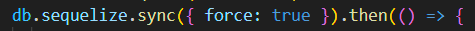

# README.md

IMPORTANT: Once you've cloned this to your forked repository, ensure that you continuously update this document as you complete each task to demonstrate your ongoing progress.

Please include your shared repository link here: https://github.com/KarlPham/A2-Khoa--22028921.git

Example:
Choiru's shared repository: https://github.com/choiruzain-latrobe/Assignment2.git


Make sure for **your case it is in Private**
## Access Database
1 **Plsql Cheat Sheet:**
You can refer to the PostgreSQL cheat sheet [here](https://www.postgresqltutorial.com/postgresql-cheat-sheet/).

2 **Know the Container ID:**
To find out the container ID, execute the following command:
   ```bash
   docker ps
    9958a3a534c9   testsystem-nginx           "/docker-entrypoint.…"   6 minutes ago   Up 6 minutes   0.0.0.0:80->80/tcp   testsystem-nginx-1
    53121618baa4   testsystem-frontend        "docker-entrypoint.s…"   6 minutes ago   Up 6 minutes   3000/tcp             testsystem-frontend-1
    c89e46ac94b0   testsystem-api             "docker-entrypoint.s…"   6 minutes ago   Up 6 minutes   5000/tcp             testsystem-api-1
    9f4aea7cf538   postgres:15.3-alpine3.18   "docker-entrypoint.s…"   6 minutes ago   Up 6 minutes   5432/tcp             testsystem-db-1
   ```
3. Running the application

**docker compose command:**
   ```bash
   docker compose up --build
   ```

4 **Access postgreSQL in the container:**
Once you have the container ID, you can execute the container using the following command:
You will see the example of running the PostgreSQL inside the container.
   ```bash
   docker exec -it assignment2-main-db-1 psql -U postgres
   choiruzain@MacMarichoy TestSystem % docker exec -it testsystem-db-1 psql -U postgres                                       
   psql (15.3)
   Type "help" for help.
   
   postgres=# \dt
             List of relations
    Schema |   Name   | Type  |  Owner   
   --------+----------+-------+----------
    public | contacts | table | postgres
    public | phones   | table | postgres
   (2 rows)
  
    postgres=# select * from contacts;
    id |  name  |         createdAt         |         updatedAt         
   ----+--------+---------------------------+---------------------------
     1 | Helmut | 2024-08-08 11:57:57.88+00 | 2024-08-08 11:57:57.88+00
    (1 row)
    postgres=# select * from phones;
    id | phone_type |   number    | contactId |         createdAt          |         updatedAt          
   ----+------------+-------------+-----------+----------------------------+----------------------------
     1 | Work       | 081431      |         1 | 2024-08-08 11:59:04.386+00 | 2024-08-08 11:59:04.386+00


postgres=# select * from contacts;
   ```
Replace `container_ID` with the actual ID of the container you want to execute.

## Executing API

### Contact API


1. Add contacts API  (POST)
```bash
http post http://localhost/api/contacts name="Choiru"
        
choiruzain@MacMarichoy-7 TestSystem % http post http://localhost/api/contacts name="Choiru"
HTTP/1.1 200 OK
Access-Control-Allow-Origin: http://localhost:3000
Connection: keep-alive
Content-Length: 102
Content-Type: application/json; charset=utf-8
Date: Thu, 08 Aug 2024 21:01:53 GMT
ETag: W/"66-FmPYAaIkyQoroDwP2JsAZjWTAxs"
Server: nginx/1.25.1
Vary: Origin
X-Powered-By: Express

{
"createdAt": "2024-08-08T21:01:53.017Z",
"id": 1,
"name": "Choiru",
"updatedAt": "2024-08-08T21:01:53.017Z"
}

```
2 Get contacts API  (GET)

```bash
http get http://localhost/api/contacts


choiruzain@MacMarichoy-7 TestSystem % http get http://localhost/api/contacts
HTTP/1.1 200 OK
Access-Control-Allow-Origin: http://localhost:3000
Connection: keep-alive
Content-Length: 104
Content-Type: application/json; charset=utf-8
Date: Thu, 08 Aug 2024 21:04:58 GMT
ETag: W/"68-V+4KuL2xahYt8YAkKG6rKdR7wHg"
Server: nginx/1.25.1
Vary: Origin
X-Powered-By: Express

[
{
"createdAt": "2024-08-08T21:01:53.017Z",
"id": 1,
"name": "Choiru",
"updatedAt": "2024-08-08T21:01:53.017Z"
}
]


```
3. Show/create the API commmand to delete the contacts (DELETE)

```bash


```

4. Show/create the API command to edit the contacts (PUT)
```
http get http://localhost/api/contacts/1/phones

```

### Phone API


#### Task 1:
1. Change the button label from contact component from "Delete" to "Delete Contact" 

Code:
<!-- the button label has been change from "Delete" to "Delete Contact" -->


User interface:

Before:


After:


2. Change the button label in phone component from "Add" to e.g "Add Choiru’s Phone" 

Code:

<!-- Change the button labe in NewPhone component from "Add phone" to add "Add {contact.name} phone" -->

<!-- The {contact.name} part is a dynamic value (likely from a prop or state), which inserts the current contact’s name into the button's label. -->


Image:

Before:


After:


3. Change the placeholder text "Name" with input type text into a drop-down menu with 4 categories (3
Marks)
Code: 
<!-- The <select> element creates a dropdown menu where users can choose from a list of options. -->

<!-- value={name}: The value attribute binds the selected value of the dropdown to the name state, ensuring the dropdown reflects the current state value. -->

<!-- onChange={(e) => setName(e.target.value)}: This event handler updates the name state with the selected option's value when the user selects a new option. -->


Image:


4. In the <tr> element of the table, change the label "Name" to "Phone Type" 
Code:


Image:

Before:


After:


##### Task 2

1. Show the API command for “Show Contact” and provide a screenshot of the output (1 Mark)

```bash
Command:
http get http://localhost/api/contacts

Output:
HTTP/1.1 200 OK
Access-Control-Allow-Origin: http://localhost:3000
Connection: keep-alive
Content-Length: 104
Content-Type: application/json; charset=utf-8
Date: Tue, 24 Sep 2024 03:23:32 GMT
ETag: W/"68-XLFFy+uHAYMjDlFZFEN2GwKr3kk"
Server: nginx/1.25.1
Vary: Origin
X-Powered-By: Express

[
    {
        "createdAt": "2024-09-24T02:51:02.022Z",
        "id": 2,
        "name": "Choiru",
        "updatedAt": "2024-09-24T02:51:02.022Z"
    }
]
```
2. Show the API command for “Add Contact” and provide a screenshot of the output (1 Mark)

```bash
Command:
http post http://localhost/api/contacts name="Karl"

Output:
HTTP/1.1 200 OK
Access-Control-Allow-Origin: http://localhost:3000
Connection: keep-alive
Content-Length: 100
Content-Type: application/json; charset=utf-8
Date: Tue, 24 Sep 2024 03:29:50 GMT
ETag: W/"64-xkvqbvEPA1RCAi2DWHI8ty1uf/k"
Server: nginx/1.25.1
Vary: Origin
X-Powered-By: Express

{
    "createdAt": "2024-09-24T03:29:50.372Z",
    "id": 4,
    "name": "Karl",
    "updatedAt": "2024-09-24T03:29:50.372Z"
}
```

3. Show the API command for “Delete Contact” and provide a screenshot of the output (1 Marks)

```bash
Command:
http delete http://localhost/api/contacts/4

Output:
HTTP/1.1 200 OK
Access-Control-Allow-Origin: http://localhost:3000
Connection: keep-alive
Content-Length: 47
Content-Type: application/json; charset=utf-8
Date: Tue, 24 Sep 2024 03:35:28 GMT
ETag: W/"2f-i0D5Qo4IGfH+OpTTITmyTnSzFvU"
Server: nginx/1.25.1
Vary: Origin
X-Powered-By: Express

{
    "message": "Contact was deleted successfully!"
}
```
4. Show the API command for “Update Contact” and provide a screenshot of the output (1 Marks)

```bash
Command:
http put http://localhost/api/contacts/2 name="Karl"

Output:
HTTP/1.1 200 OK
Access-Control-Allow-Origin: http://localhost:3000
Connection: keep-alive
Content-Length: 47
Content-Type: application/json; charset=utf-8
Date: Tue, 24 Sep 2024 03:42:25 GMT
ETag: W/"2f-9DEigpdI8FmatdY6qgJYc7CM5hQ"
Server: nginx/1.25.1
Vary: Origin
X-Powered-By: Express

{
    "message": "Contact was updated successfully."
}
```

5. Show the API command for “Show Phone” and provide a screenshot of the output (1 Mark)

```bash
Commend:
http get http://localhost/api/contacts/2/phones

Output:
HTTP/1.1 200 OK
Access-Control-Allow-Origin: http://localhost:3000
Connection: keep-alive
Content-Length: 137
Content-Type: application/json; charset=utf-8
Date: Tue, 24 Sep 2024 03:50:41 GMT
ETag: W/"89-mZXShvt7yfB5kLXdbgRU/5fhlSs"
Server: nginx/1.25.1
Vary: Origin
X-Powered-By: Express

[
    {
        "contactId": 2,
        "createdAt": "2024-09-24T03:49:25.498Z",
        "id": 2,
        "name": "home",
        "number": "123456789",
        "updatedAt": "2024-09-24T03:49:25.498Z"
    }
]
```
6. Show the API command for “Add Phone” and provide a screenshot of the output (1 Marks)

```bash
Command:
http post http://localhost/api/contacts/2/phones name="work" number="0987654321"

Output:
HTTP/1.1 200 OK
Access-Control-Allow-Origin: http://localhost:3000
Connection: keep-alive
Content-Length: 136
Content-Type: application/json; charset=utf-8
Date: Tue, 24 Sep 2024 04:03:26 GMT
ETag: W/"88-XTIBLu0MTdjF5i9JG6nwfQv/SRc"
Server: nginx/1.25.1
Vary: Origin
X-Powered-By: Express

{
    "contactId": 2,
    "createdAt": "2024-09-24T04:03:26.972Z",
    "id": 4,
    "name": "work",
    "number": "0987654321",
    "updatedAt": "2024-09-24T04:03:26.972Z"
}
```

7. Show the API command for “Delete Phone” and provide a screenshot of the output (1 Marks)

```bash
Command:
http delete http://localhost/api/contacts/2/phones/4

Output:
HTTP/1.1 200 OK
Access-Control-Allow-Origin: http://localhost:3000
Connection: keep-alive
Content-Length: 45
Content-Type: application/json; charset=utf-8
Date: Tue, 24 Sep 2024 04:07:25 GMT
ETag: W/"2d-FdOer7L1Hk5YcQlrlpn01BrNJmA"
Server: nginx/1.25.1
Vary: Origin
X-Powered-By: Express

{
    "message": "Phone was deleted successfully!"
}
```

8. Show the API command for “Update Phone” and provide a screenshot of the output (1 Marks)

```bash
Command:
http put http://localhost/api/contacts/2/phones/2 name="family" number="66668888"

Output:
HTTP/1.1 200 OK
Access-Control-Allow-Origin: http://localhost:3000
Connection: keep-alive
Content-Length: 45
Content-Type: application/json; charset=utf-8
Date: Tue, 24 Sep 2024 04:16:28 GMT
ETag: W/"2d-p9Lx2PQGimApZ9nkrVa0opZVZlQ"
Server: nginx/1.25.1
Vary: Origin
X-Powered-By: Express

{
    "message": "Phone was updated successfully."
}
```

###### Task 3

1. Modify the contacts Table (5 Marks):
a. Update the contacts table to include the following attributes:
i. id
ii. Name
iii. Address


There are 2 methods when modify the contact Table in the Db using Sequelize:

- Sequelize's .sync() method synchronizes your models with the database by creating or altering tables to match the current state of your models.

- Migrations are scripts that define how to apply changes to the database schema (like adding columns, changing data types, etc.) in a step-by-step manner. They allow you to evolve your database schema over time in a controlled way.

Comparison:
bash```


In this project, I use Sequelize's .sync() method due to the convenient it bring

To set up this method, I changed **db.sequelize.sync({ force: false })** in (./api/app.js) to **db.sequelize.sync({ after: true })**

Code:



After that, I modified contacts model in (./api/models/contacts.model.js)

Code:


Database:


2. Modify the phones Table (5 Marks):
a. Update the phones table to include the following attributes:
i. id
ii. phone_type
iii. phone_number
iv. contactId

Do the same steps as above, but this time I modified phones model in (./api/models/phones.model.js) 

Code:


Database:


3. Adjust the Front-End (4 Marks):
a. Modify the front-end to align with the updated backend structure.

Before modify the front-end to align with the updated backed structure, I need to modify Api first to handle the database changed

- Controller API contacts changes (./api/controllers/contact.controllers.js)

Code:


Explanation:

 This code is a controller function in a Node.js and Express application that creates a new contact record in the database (POST request)

 By adding **req.body.address** expected to contain **address** fields submitted by the client to the new database

 Only need to change the POST request because it add new fields which is **address**, the others request don't need to change as long as the ```bash contactId ``` remains the same

- Controller API phones changes (./api/controllers/phone.controllers.js)

Code:


Explanation:
 This code is a controller function in a Node.js and Express application that creates a new phone record in the database (POST request)

 Modified from **name**, **number** to **phone_type**, **phone_number**.

 Only need to change the POST request because its adjust existed fields which is **name** and **number** to **phone_type**, **phone_number**. The others request don't need to change as long as the ```bash contactId ``` and ```bash phoneId ``` remains the same

- Frontend changes

Contacts:

Start with the ```bash NewContact.js ``` (./frontend/src/components/NewContacts.js)

Code:


Explanation:
 The form now allows users to input both a name and address for a new contact.

 When the form is submitted, a POST request is sent to the API to create the contact, passing both the **name** and **address** in the request body.

 If the contact is successfully created, the new contact is added to the contacts array, and the form inputs are reset.

Image:


After that, begin to adjust codes in ``bash Contact.js`` (./frontend/src/components/Contact.js)

Code:


Explanation:
 Added the <p>{contact.address}</p> element inside the contact's title section to display the contact's address.

 Now both the name and address will be displayed for each contact.

Image:


No need to change in the ``bash ContactList.js`` because ``bash Contact.js`` component already handles displaying both name and address then ``bash ContactList.js`` display all the ``bash Contact.js``

Image:


Phones:
Do exactly same steps in adjust Contact's frontend, the result shows below

``bash NewPhone.js``

Code:


``bash Phone.js``

Code:


Image:


Again no need to change in the ``bash PhoneList.js`` because it display alls ``bash Phone.js`` components

**Final result**


4. Test All APIs related to table modified contacts and phones (8 Marks):
-Contacts:

**GET METHOD**
```bash
http get http://localhost/api/contacts
HTTP/1.1 200 OK
Access-Control-Allow-Origin: http://localhost:3000
Connection: keep-alive
Content-Length: 247
Content-Type: application/json; charset=utf-8
Date: Fri, 27 Sep 2024 08:32:50 GMT
ETag: W/"f7-bG0Isqino/a+MUnEyZaHNV/wWJ8"
Server: nginx/1.25.1
Vary: Origin
X-Powered-By: Express

[
    {
        "address": "BrayBrook",
        "createdAt": "2024-09-27T07:48:53.209Z",
        "id": 2,
        "name": "Karl",
        "updatedAt": "2024-09-27T07:48:53.209Z"
    },
    {
        "address": "Bendigo",
        "createdAt": "2024-09-27T07:56:07.196Z",
        "id": 3,
        "name": "Choiru",
        "updatedAt": "2024-09-27T07:56:07.196Z"
    }
]
```

**POST METHOD**
```bash
http post http://localhost/api/contacts name="Cheezu" address="bundoora"
HTTP/1.1 200 OK
Access-Control-Allow-Origin: http://localhost:3000
Connection: keep-alive
Content-Length: 123
Content-Type: application/json; charset=utf-8
Date: Fri, 27 Sep 2024 08:37:04 GMT
ETag: W/"7b-WIqYaabEogkTxtW7co/urRBaA+0"
Server: nginx/1.25.1
Vary: Origin
X-Powered-By: Express

{
    "address": "bundoora",
    "createdAt": "2024-09-27T08:37:04.518Z",
    "id": 4,
    "name": "Cheezu",
    "updatedAt": "2024-09-27T08:37:04.518Z"
}
```

**DELETE METHOD**
```bash
http delete http://localhost/api/contacts/4
HTTP/1.1 200 OK
Access-Control-Allow-Origin: http://localhost:3000
Connection: keep-alive
Content-Length: 47
Content-Type: application/json; charset=utf-8
Date: Fri, 27 Sep 2024 08:39:00 GMT
ETag: W/"2f-i0D5Qo4IGfH+OpTTITmyTnSzFvU"
Server: nginx/1.25.1
Vary: Origin
X-Powered-By: Express

{
    "message": "Contact was deleted successfully!"
}
```

**PUT METHOD**
```bash
http put http://localhost/api/contacts/2 name="Khoa" address="Melbourne"
HTTP/1.1 200 OK
Access-Control-Allow-Origin: http://localhost:3000
Connection: keep-alive
Content-Length: 47
Content-Type: application/json; charset=utf-8
Date: Fri, 27 Sep 2024 08:44:55 GMT
ETag: W/"2f-9DEigpdI8FmatdY6qgJYc7CM5hQ"
Server: nginx/1.25.1
Vary: Origin
X-Powered-By: Express

{
    "message": "Contact was updated successfully."
}
```

- Phones:

**GET METHOD**
```bash
http get http://localhost/api/contacts/2/phones
HTTP/1.1 200 OK
Access-Control-Allow-Origin: http://localhost:3000
Connection: keep-alive
Content-Length: 299
Content-Type: application/json; charset=utf-8
Date: Fri, 27 Sep 2024 08:47:27 GMT
ETag: W/"12b-yJSNDcAfv4xbHFZzofKJn3BGh+I"
Server: nginx/1.25.1
Vary: Origin
X-Powered-By: Express

[
    {
        "contactId": 2,
        "createdAt": "2024-09-27T08:23:18.972Z",
        "id": 1,
        "phone_number": "123456789",
        "phone_type": "home",
        "updatedAt": "2024-09-27T08:23:18.972Z"
    },
    {
        "contactId": 2,
        "createdAt": "2024-09-27T08:27:00.714Z",
        "id": 2,
        "phone_number": "987654432",
        "phone_type": "mobile",
        "updatedAt": "2024-09-27T08:27:00.714Z"
    }
]
```

**POST METHOD**
```bash
http post http://localhost/api/contacts/2/phones phone_type="work" phone_number="88886666"
HTTP/1.1 200 OK
Access-Control-Allow-Origin: http://localhost:3000
Connection: keep-alive
Content-Length: 146
Content-Type: application/json; charset=utf-8
Date: Fri, 27 Sep 2024 08:54:05 GMT
ETag: W/"92-ZEEpWZ72PPXKeblW7fzrEKKWTTs"
Server: nginx/1.25.1
Vary: Origin
X-Powered-By: Express

{
    "contactId": 2,
    "createdAt": "2024-09-27T08:54:05.819Z",
    "id": 4,
    "phone_number": "88886666",
    "phone_type": "work",
    "updatedAt": "2024-09-27T08:54:05.819Z"
}
```

**DELETE METHOD**
```bash
http delete http://localhost/api/contacts/2/phones/4
HTTP/1.1 200 OK
Access-Control-Allow-Origin: http://localhost:3000
Connection: keep-alive
Content-Length: 45
Content-Type: application/json; charset=utf-8
Date: Fri, 27 Sep 2024 08:58:19 GMT
ETag: W/"2d-FdOer7L1Hk5YcQlrlpn01BrNJmA"
Server: nginx/1.25.1
Vary: Origin
X-Powered-By: Express

{
    "message": "Phone was deleted successfully!"
}
```

**PUT METHOD**
```bash
 http put http://localhost/api/contacts/2/phones/1 phone_number="123456788"
HTTP/1.1 200 OK
Access-Control-Allow-Origin: http://localhost:3000
Connection: keep-alive
Content-Length: 45
Content-Type: application/json; charset=utf-8
Date: Fri, 27 Sep 2024 09:01:15 GMT
ETag: W/"2d-p9Lx2PQGimApZ9nkrVa0opZVZlQ"
Server: nginx/1.25.1
Vary: Origin
X-Powered-By: Express

{
    "message": "Phone was updated successfully."
}
```