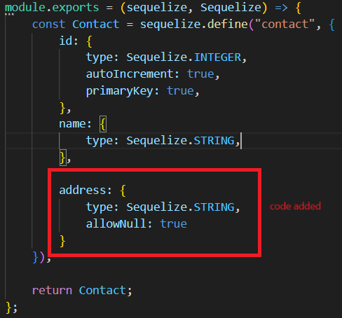
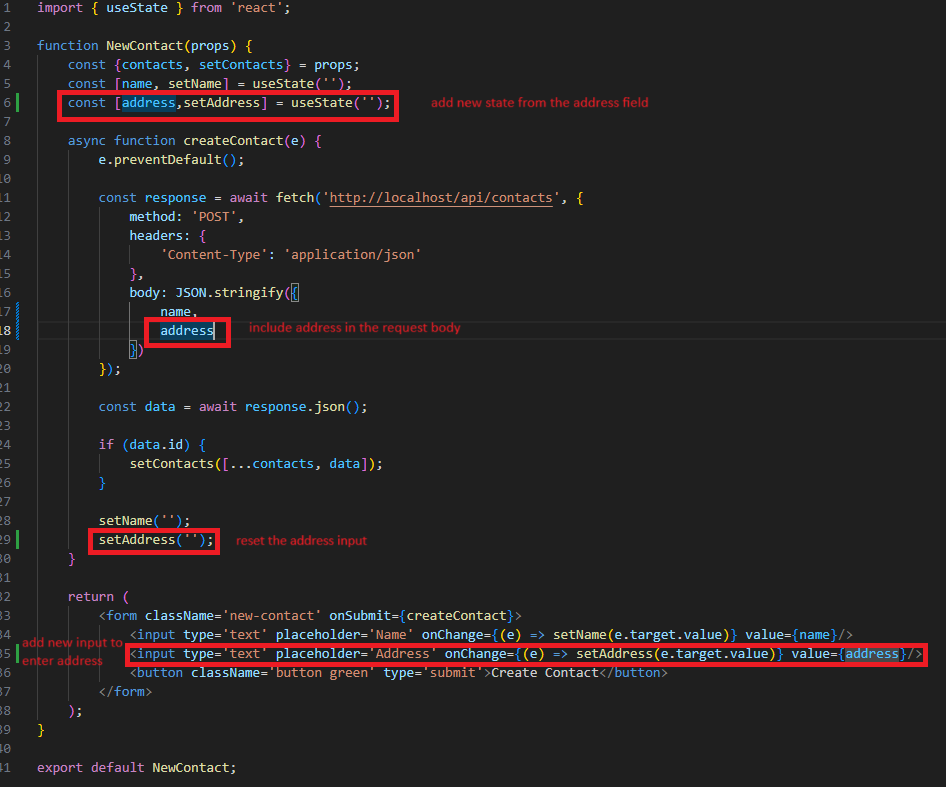
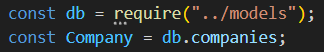

# README.md

IMPORTANT: Once you've cloned this to your forked repository, ensure that you continuously update this document as you complete each task to demonstrate your ongoing progress.

Please include your shared repository link here: https://github.com/KarlPham/A2-Khoa--22028921.git

Example:
Choiru's shared repository: https://github.com/choiruzain-latrobe/Assignment2.git


Make sure for **your case it is in Private**

1 **Plsql Cheat Sheet:**
You can refer to the PostgreSQL cheat sheet [here](https://www.postgresqltutorial.com/postgresql-cheat-sheet/).

2 **Know the Container ID:**
To find out the container ID, execute the following command:
   ```bash
   docker ps
    9958a3a534c9   testsystem-nginx           "/docker-entrypoint.…"   6 minutes ago   Up 6 minutes   0.0.0.0:80->80/tcp   testsystem-nginx-1
    53121618baa4   testsystem-frontend        "docker-entrypoint.s…"   6 minutes ago   Up 6 minutes   3000/tcp             testsystem-frontend-1
    c89e46ac94b0   testsystem-api             "docker-entrypoint.s…"   6 minutes ago   Up 6 minutes   5000/tcp             testsystem-api-1
    9f4aea7cf538   postgres:15.3-alpine3.18   "docker-entrypoint.s…"   6 minutes ago   Up 6 minutes   5432/tcp             testsystem-db-1
   ```
3. Running the application

**docker compose command:**
   ```bash
   docker compose up --build
   ```

4 **Access postgreSQL in the container:**
Once you have the container ID, you can execute the container using the following command:
You will see the example of running the PostgreSQL inside the container.
   ```bash
   docker exec -it assignment2-main-db-1 psql -U postgres
   choiruzain@MacMarichoy TestSystem % docker exec -it testsystem-db-1 psql -U postgres                                       
   psql (15.3)
   Type "help" for help.
   
   postgres=# \dt
             List of relations
    Schema |   Name   | Type  |  Owner   
   --------+----------+-------+----------
    public | contacts | table | postgres
    public | phones   | table | postgres
   (2 rows)
  
    postgres=# select * from contacts;
    id |  name  |         createdAt         |         updatedAt         
   ----+--------+---------------------------+---------------------------
     1 | Helmut | 2024-08-08 11:57:57.88+00 | 2024-08-08 11:57:57.88+00
    (1 row)
    postgres=# select * from phones;
    id | phone_type |   number    | contactId |         createdAt          |         updatedAt          
   ----+------------+-------------+-----------+----------------------------+----------------------------
     1 | Work       | 081431      |         1 | 2024-08-08 11:59:04.386+00 | 2024-08-08 11:59:04.386+00


postgres=# select * from contacts;
   ```
Replace `container_ID` with the actual ID of the container you want to execute.


1. Add contacts API  (POST)
```bash
http post http://localhost/api/contacts name="Choiru"
        
choiruzain@MacMarichoy-7 TestSystem % http post http://localhost/api/contacts name="Choiru"
HTTP/1.1 200 OK
Access-Control-Allow-Origin: http://localhost:3000
Connection: keep-alive
Content-Length: 102
Content-Type: application/json; charset=utf-8
Date: Thu, 08 Aug 2024 21:01:53 GMT
ETag: W/"66-FmPYAaIkyQoroDwP2JsAZjWTAxs"
Server: nginx/1.25.1
Vary: Origin
X-Powered-By: Express

{
"createdAt": "2024-08-08T21:01:53.017Z",
"id": 1,
"name": "Choiru",
"updatedAt": "2024-08-08T21:01:53.017Z"
}

```
2 Get contacts API  (GET)

```bash
http get http://localhost/api/contacts


choiruzain@MacMarichoy-7 TestSystem % http get http://localhost/api/contacts
HTTP/1.1 200 OK
Access-Control-Allow-Origin: http://localhost:3000
Connection: keep-alive
Content-Length: 104
Content-Type: application/json; charset=utf-8
Date: Thu, 08 Aug 2024 21:04:58 GMT
ETag: W/"68-V+4KuL2xahYt8YAkKG6rKdR7wHg"
Server: nginx/1.25.1
Vary: Origin
X-Powered-By: Express

[
{
"createdAt": "2024-08-08T21:01:53.017Z",
"id": 1,
"name": "Choiru",
"updatedAt": "2024-08-08T21:01:53.017Z"
}
]


```
3. Show/create the API commmand to delete the contacts (DELETE)

```bash


```

4. Show/create the API command to edit the contacts (PUT)
```
http get http://localhost/api/contacts/1/phones

```


<detail>
<summary>Task 1</summary>

1. Change the button label from contact component from "Delete" to "Delete Contact" 

Code:
<!-- the button label has been change from "Delete" to "Delete Contact" -->


User interface:

Before:


After:


2. Change the button label in phone component from "Add" to e.g "Add Choiru’s Phone" 

Code:

<!-- Change the button labe in NewPhone component from "Add phone" to add "Add {contact.name} phone" -->

<!-- The {contact.name} part is a dynamic value (likely from a prop or state), which inserts the current contact’s name into the button's label. -->


Image:

Before:


After:


3. Change the placeholder text "Name" with input type text into a drop-down menu with 4 categories (3
Marks)
Code: 
<!-- The <select> element creates a dropdown menu where users can choose from a list of options. -->

<!-- value={name}: The value attribute binds the selected value of the dropdown to the name state, ensuring the dropdown reflects the current state value. -->

<!-- onChange={(e) => setName(e.target.value)}: This event handler updates the name state with the selected option's value when the user selects a new option. -->


Image:


4. In the <tr> element of the table, change the label "Name" to "Phone Type" 
Code:


Image:

Before:


After:


<details>
 <summary>Task 2</summary>

1. Show the API command for “Show Contact” and provide a screenshot of the output (1 Mark)

```bash
Command:
http get http://localhost/api/contacts

Output:
HTTP/1.1 200 OK
Access-Control-Allow-Origin: http://localhost:3000
Connection: keep-alive
Content-Length: 104
Content-Type: application/json; charset=utf-8
Date: Tue, 24 Sep 2024 03:23:32 GMT
ETag: W/"68-XLFFy+uHAYMjDlFZFEN2GwKr3kk"
Server: nginx/1.25.1
Vary: Origin
X-Powered-By: Express

[
    {
        "createdAt": "2024-09-24T02:51:02.022Z",
        "id": 2,
        "name": "Choiru",
        "updatedAt": "2024-09-24T02:51:02.022Z"
    }
]
```
2. Show the API command for “Add Contact” and provide a screenshot of the output (1 Mark)

```bash
Command:
http post http://localhost/api/contacts name="Karl"

Output:
HTTP/1.1 200 OK
Access-Control-Allow-Origin: http://localhost:3000
Connection: keep-alive
Content-Length: 100
Content-Type: application/json; charset=utf-8
Date: Tue, 24 Sep 2024 03:29:50 GMT
ETag: W/"64-xkvqbvEPA1RCAi2DWHI8ty1uf/k"
Server: nginx/1.25.1
Vary: Origin
X-Powered-By: Express

{
    "createdAt": "2024-09-24T03:29:50.372Z",
    "id": 4,
    "name": "Karl",
    "updatedAt": "2024-09-24T03:29:50.372Z"
}
```

3. Show the API command for “Delete Contact” and provide a screenshot of the output (1 Marks)

```bash
Command:
http delete http://localhost/api/contacts/4

Output:
HTTP/1.1 200 OK
Access-Control-Allow-Origin: http://localhost:3000
Connection: keep-alive
Content-Length: 47
Content-Type: application/json; charset=utf-8
Date: Tue, 24 Sep 2024 03:35:28 GMT
ETag: W/"2f-i0D5Qo4IGfH+OpTTITmyTnSzFvU"
Server: nginx/1.25.1
Vary: Origin
X-Powered-By: Express

{
    "message": "Contact was deleted successfully!"
}
```
4. Show the API command for “Update Contact” and provide a screenshot of the output (1 Marks)

```bash
Command:
http put http://localhost/api/contacts/2 name="Karl"

Output:
HTTP/1.1 200 OK
Access-Control-Allow-Origin: http://localhost:3000
Connection: keep-alive
Content-Length: 47
Content-Type: application/json; charset=utf-8
Date: Tue, 24 Sep 2024 03:42:25 GMT
ETag: W/"2f-9DEigpdI8FmatdY6qgJYc7CM5hQ"
Server: nginx/1.25.1
Vary: Origin
X-Powered-By: Express

{
    "message": "Contact was updated successfully."
}
```

5. Show the API command for “Show Phone” and provide a screenshot of the output (1 Mark)

```bash
Command:
http get http://localhost/api/contacts/2/phones

Output:
HTTP/1.1 200 OK
Access-Control-Allow-Origin: http://localhost:3000
Connection: keep-alive
Content-Length: 137
Content-Type: application/json; charset=utf-8
Date: Tue, 24 Sep 2024 03:50:41 GMT
ETag: W/"89-mZXShvt7yfB5kLXdbgRU/5fhlSs"
Server: nginx/1.25.1
Vary: Origin
X-Powered-By: Express

[
    {
        "contactId": 2,
        "createdAt": "2024-09-24T03:49:25.498Z",
        "id": 2,
        "name": "home",
        "number": "123456789",
        "updatedAt": "2024-09-24T03:49:25.498Z"
    }
]
```
6. Show the API command for “Add Phone” and provide a screenshot of the output (1 Marks)

```bash
Command:
http post http://localhost/api/contacts/2/phones name="work" number="0987654321"

Output:
HTTP/1.1 200 OK
Access-Control-Allow-Origin: http://localhost:3000
Connection: keep-alive
Content-Length: 136
Content-Type: application/json; charset=utf-8
Date: Tue, 24 Sep 2024 04:03:26 GMT
ETag: W/"88-XTIBLu0MTdjF5i9JG6nwfQv/SRc"
Server: nginx/1.25.1
Vary: Origin
X-Powered-By: Express

{
    "contactId": 2,
    "createdAt": "2024-09-24T04:03:26.972Z",
    "id": 4,
    "name": "work",
    "number": "0987654321",
    "updatedAt": "2024-09-24T04:03:26.972Z"
}
```

7. Show the API command for “Delete Phone” and provide a screenshot of the output (1 Marks)

```bash
Command:
http delete http://localhost/api/contacts/2/phones/4

Output:
HTTP/1.1 200 OK
Access-Control-Allow-Origin: http://localhost:3000
Connection: keep-alive
Content-Length: 45
Content-Type: application/json; charset=utf-8
Date: Tue, 24 Sep 2024 04:07:25 GMT
ETag: W/"2d-FdOer7L1Hk5YcQlrlpn01BrNJmA"
Server: nginx/1.25.1
Vary: Origin
X-Powered-By: Express

{
    "message": "Phone was deleted successfully!"
}
```

8. Show the API command for “Update Phone” and provide a screenshot of the output (1 Marks)

```bash
Command:
http put http://localhost/api/contacts/2/phones/2 name="family" number="66668888"

Output:
HTTP/1.1 200 OK
Access-Control-Allow-Origin: http://localhost:3000
Connection: keep-alive
Content-Length: 45
Content-Type: application/json; charset=utf-8
Date: Tue, 24 Sep 2024 04:16:28 GMT
ETag: W/"2d-p9Lx2PQGimApZ9nkrVa0opZVZlQ"
Server: nginx/1.25.1
Vary: Origin
X-Powered-By: Express

{
    "message": "Phone was updated successfully."
}
```
<detail>
<summary>Task 3</summary>

1. Modify the contacts Table (5 Marks):

a. Update the contacts table to include the following attributes:

i. id

ii. Name

iii. Address


There are 2 methods when modify the contact **Table** in the **Database** using Sequelize:

- ```Sequelize's .sync()``` method synchronizes your models with the database by creating or altering tables to match the current state of your models.

- Migrations are scripts that define how to apply changes to the database schema (like adding columns, changing data types, etc.) in a step-by-step manner. They allow you to evolve your database schema over time in a controlled way.

**Comparison:**


**In this project, I use ```Sequelize's .sync()``` method due to the convenient it bring**

- To set up this method, I changed **db.sequelize.sync({ force: false })** in (./api/app.js) to **db.sequelize.sync({ after: true })**

Code:


- After that, I modified ```contact.models.js``` in (./api/models/contact.models.js)

Code:



Alter Database:


2. Modify the phones Table (5 Marks):

a. Update the phones table to include the following attributes:

i. id

ii. phone_type

iii. phone_number

iv. contactId

- Do the same steps as above, but this time I modified ```phone.models.js``` in (./api/models/phones.model.js) 

Code:


Alter Database:


3. Adjust the Front-End (4 Marks):

a. Modify the front-end to align with the updated backend structure.

Before modify the front-end to align with the updated backend structure, I need to modify the logic of Api first to handle the database changed

**```contact.controller.js``` changes (./api/controllers/contact.controller.js)**

Code:


Explanation:

- This code is a controller function in a Node.js and Express application that creates a new contact record in the database (POST request)

- By adding **req.body.address** expected to contain **address** fields submitted by the client to the new database

- Only need to change the POST request because it add new fields which is ```address```, the others request don't need to change as long as the ```contactId``` remains the same

**```phone.controller.js``` changes (./api/controllers/phone.controller.js)**

Code:


Explanation:
- This code is a controller function in a Node.js and Express application that creates a new phone record in the database (POST request)

- Modified from **name**, **number** to **phone_type**, **phone_number**.

- Only the POST request needs to be changed, as it updates the existing fields from ```name``` and ```number``` to ```phone_type``` and ```phone_number```. The other requests don't need any changes as long as the ```contactId``` and ```phoneId``` remain the same.

- Frontend changes

**Contacts**:

Start with the ```NewContact.js ``` (./frontend/src/components/NewContact.js)

Code:



Explanation:

- The form now allows users to input both a ```name``` and ```address``` for a ```NewContact```.

- When the form is submitted, a POST request is sent to the API to create the contact, passing both the ```name``` and ```address``` in the request body.

- If the contact is successfully created, the new contact is added to the contacts array, and the form inputs are reset.

Image:


After that, begin to adjust codes in ``Contact.js`` (./frontend/src/components/Contact.js)

Code:


Explanation:

- Added the ```<p>{contact.address}</p>``` element inside the contact's title section to display the contact's address.

- Now both the name and address will be displayed for each contact.

Image:


No need to change in the ``ContactList.js`` because ``Contact.js`` component already handles displaying both name and address then ``ContactList.js`` display all the Contacts

Image:


**Phones:**

Do exactly same steps in adjust Contact's frontend, the result shows below

``NewPhone.js``

Code:


``Phone.js``

Code:


Image:


Again no need to change in the ``PhoneList.js`` because it display alls Phone components

**Final result**


4. Test All APIs related to table modified contacts and phones (8 Marks):

- Contacts:

**GET METHOD**
```bash
http get http://localhost/api/contacts
HTTP/1.1 200 OK
Access-Control-Allow-Origin: http://localhost:3000
Connection: keep-alive
Content-Length: 247
Content-Type: application/json; charset=utf-8
Date: Fri, 27 Sep 2024 08:32:50 GMT
ETag: W/"f7-bG0Isqino/a+MUnEyZaHNV/wWJ8"
Server: nginx/1.25.1
Vary: Origin
X-Powered-By: Express

[
    {
        "address": "BrayBrook",
        "createdAt": "2024-09-27T07:48:53.209Z",
        "id": 2,
        "name": "Karl",
        "updatedAt": "2024-09-27T07:48:53.209Z"
    },
    {
        "address": "Bendigo",
        "createdAt": "2024-09-27T07:56:07.196Z",
        "id": 3,
        "name": "Choiru",
        "updatedAt": "2024-09-27T07:56:07.196Z"
    }
]
```

**POST METHOD**
```bash
http post http://localhost/api/contacts name="Cheezu" address="bundoora"
HTTP/1.1 200 OK
Access-Control-Allow-Origin: http://localhost:3000
Connection: keep-alive
Content-Length: 123
Content-Type: application/json; charset=utf-8
Date: Fri, 27 Sep 2024 08:37:04 GMT
ETag: W/"7b-WIqYaabEogkTxtW7co/urRBaA+0"
Server: nginx/1.25.1
Vary: Origin
X-Powered-By: Express

{
    "address": "bundoora",
    "createdAt": "2024-09-27T08:37:04.518Z",
    "id": 4,
    "name": "Cheezu",
    "updatedAt": "2024-09-27T08:37:04.518Z"
}
```

**DELETE METHOD**
```bash
http delete http://localhost/api/contacts/4
HTTP/1.1 200 OK
Access-Control-Allow-Origin: http://localhost:3000
Connection: keep-alive
Content-Length: 47
Content-Type: application/json; charset=utf-8
Date: Fri, 27 Sep 2024 08:39:00 GMT
ETag: W/"2f-i0D5Qo4IGfH+OpTTITmyTnSzFvU"
Server: nginx/1.25.1
Vary: Origin
X-Powered-By: Express

{
    "message": "Contact was deleted successfully!"
}
```

**PUT METHOD**
```bash
http put http://localhost/api/contacts/2 name="Khoa" address="Melbourne"
HTTP/1.1 200 OK
Access-Control-Allow-Origin: http://localhost:3000
Connection: keep-alive
Content-Length: 47
Content-Type: application/json; charset=utf-8
Date: Fri, 27 Sep 2024 08:44:55 GMT
ETag: W/"2f-9DEigpdI8FmatdY6qgJYc7CM5hQ"
Server: nginx/1.25.1
Vary: Origin
X-Powered-By: Express

{
    "message": "Contact was updated successfully."
}
```

- Phones:

**GET METHOD**
```bash
http get http://localhost/api/contacts/2/phones
HTTP/1.1 200 OK
Access-Control-Allow-Origin: http://localhost:3000
Connection: keep-alive
Content-Length: 299
Content-Type: application/json; charset=utf-8
Date: Fri, 27 Sep 2024 08:47:27 GMT
ETag: W/"12b-yJSNDcAfv4xbHFZzofKJn3BGh+I"
Server: nginx/1.25.1
Vary: Origin
X-Powered-By: Express

[
    {
        "contactId": 2,
        "createdAt": "2024-09-27T08:23:18.972Z",
        "id": 1,
        "phone_number": "123456789",
        "phone_type": "home",
        "updatedAt": "2024-09-27T08:23:18.972Z"
    },
    {
        "contactId": 2,
        "createdAt": "2024-09-27T08:27:00.714Z",
        "id": 2,
        "phone_number": "987654432",
        "phone_type": "mobile",
        "updatedAt": "2024-09-27T08:27:00.714Z"
    }
]
```

**POST METHOD**
```bash
http post http://localhost/api/contacts/2/phones phone_type="work" phone_number="88886666"
HTTP/1.1 200 OK
Access-Control-Allow-Origin: http://localhost:3000
Connection: keep-alive
Content-Length: 146
Content-Type: application/json; charset=utf-8
Date: Fri, 27 Sep 2024 08:54:05 GMT
ETag: W/"92-ZEEpWZ72PPXKeblW7fzrEKKWTTs"
Server: nginx/1.25.1
Vary: Origin
X-Powered-By: Express

{
    "contactId": 2,
    "createdAt": "2024-09-27T08:54:05.819Z",
    "id": 4,
    "phone_number": "88886666",
    "phone_type": "work",
    "updatedAt": "2024-09-27T08:54:05.819Z"
}
```

**DELETE METHOD**
```bash
http delete http://localhost/api/contacts/2/phones/4
HTTP/1.1 200 OK
Access-Control-Allow-Origin: http://localhost:3000
Connection: keep-alive
Content-Length: 45
Content-Type: application/json; charset=utf-8
Date: Fri, 27 Sep 2024 08:58:19 GMT
ETag: W/"2d-FdOer7L1Hk5YcQlrlpn01BrNJmA"
Server: nginx/1.25.1
Vary: Origin
X-Powered-By: Express

{
    "message": "Phone was deleted successfully!"
}
```

**PUT METHOD**
```bash
 http put http://localhost/api/contacts/2/phones/1 phone_number="123456788"
HTTP/1.1 200 OK
Access-Control-Allow-Origin: http://localhost:3000
Connection: keep-alive
Content-Length: 45
Content-Type: application/json; charset=utf-8
Date: Fri, 27 Sep 2024 09:01:15 GMT
ETag: W/"2d-p9Lx2PQGimApZ9nkrVa0opZVZlQ"
Server: nginx/1.25.1
Vary: Origin
X-Powered-By: Express

{
    "message": "Phone was updated successfully."
}
```
<detail>
<summary>Task 4</summary>

1. Table Creation: Create a new table named `companies` with the following attributes (18 Marks):
a. company_id: Primary key, uniquely identifies each company
b. company_name: Name of the company
c. company_address: Address of the company
d. contact_id: Foreign key referencing contact_id in the contacts table

**Step 1 :**
- Define the ```Company``` model in the ```/models directory.

Code(./api/models/company.model.js):


Explanation:
 
 ```company_id```: Primary key that uniquely identifies each company.

 ```company_name```: Name of the company.

 ```company_address```: Address of the company

 ```contact_id```: Foreign key that links to the ```contacts``` table. It establishes the relationship between a company and a contact.

**Step 2:**
- Import new ```company.model.js``` sequelize file to PostgreSQL database via (./api/models/index.js)

Code:


**Step 3:**
- Check Database


2. API Creation: Develop four APIs to manage records in the companies table, like Task 2 (12 Marks).

**Step 1**
- Create a new controller file for ```company``` named ```company.controller.js``` in ./api/controllers/

Image: 


After that import database from (./models) and define ```const Company``` to access the Company model from database object

Image:



**Step 2**
- Create a new company for specific contact method in ```company.controller.js```

Code:


Explanation:
 Creating the company object: The ```company``` object is created using ```company_name```, ```company_address```, and ```contact_id``` (which is extracted from the URL parameter).

 Database Insertion: The ```Company.create()``` function is used to insert the new company into the database.

 Response: If the creation is successful, the newly created company data is returned to the client. If an error occurs, a 500 error is returned.

**Step 3**

- Create a retrieves all companies associated with a specific contact method in ```company.controller.js```

Code:


Explanation:
 Extract ```contactId```: The contactId is extracted from the URL parameters.

 Querying the Database: The Company.findAll() method retrieves all companies from the database that have a ```contact_id``` equal to the ```contactId```.

 Response: The list of companies is sent back as a response. If there's an error during the query, a 500 error message is sent.

**Step 4**

- Create a retrieves a single company based on both the ```companyId``` and ```contactId``` method in ```company.controller.js```

Code:


Explanation:
 Extract Parameters: The ```companyId``` and ```contactId``` are extracted from the URL parameters.

 Querying the Database: The ```Company.findOne()``` method finds a company that matches both the ```company_id``` and ```contact_id```. This ensures that the company belongs to the correct contact.

 Response: If a company is found, its data is sent back. If no company is found, a 404 error is returned. Any other error triggers a 500 status with an error message.

**Step 5**

- Create a updates a company's details based on the ```companyId``` and ```contactId``` method in ```company.controller.js```

Code:


Explanation:
 Extract Parameters: The ```companyId``` and ```contactId``` are extracted from the URL.

 Update the Company: The ```Company.update()``` method updates the company in the database where both ```company_id``` and ```contact_id``` match.

 Response: If the update is successful, a success message is returned. If no company is found or the request body is empty, an error message is returned. If any other error occurs, a 500 error is sent.

**Step 6**

- Create a deletes a company from the database based on the ```companyId``` and ```contactId``` method in ```company.controller.js```

Code:


Explanation:
 Extract Parameters: The ```companyId``` and ```contactId``` are extracted from the URL.

 Delete the Company: The ```Company.destroy()``` method deletes the company from the database where both ```company_id``` and ```contact_id``` match.

 Response: If the deletion is successful, a success message is returned. If no company is found, an error message is returned. Any other error will trigger a 500 status with an error message.

**Step 7**
- Create a file called ```companies.routes.js``` in ./api/routes to define the API endpoints for interacting with the Company resources.

Code: 


Route Endpoints:
 - POST ```/api/contacts/:contactId/companies:```:Create a new company for the contact specified by ```contactId```.

 - GET ```/api/contacts/:contactId/companies:```:Get all companies associated with the contact specified by ```contactId```.

 - GET ```/api/contacts/:contactId/companies/:companyId:```:Get a single company identified by ```companyId``` for the contact specified by contactId.

 - PUT ```/api/contacts/:contactId/companies/:companyId:```:Update the company identified by companyId for the contact specified by ```contactId```.

 - DELETE ```/api/contacts/:contactId/companies/:companyId:```:Delete the company identified by companyId for the contact specified by ```contactId```.

 **Step 8**

 - Register the routes in main app file which is ```app.js``` in ```./api/app.js```

 Code:


**Step 9**

- API testing

**POST**

```bash
http post http://localhost/api/contacts/1/companies company_name="Google" company_address="Mel"
HTTP/1.1 200 OK
Access-Control-Allow-Origin: http://localhost:3000
Connection: keep-alive
Content-Length: 157
Content-Type: application/json; charset=utf-8
Date: Fri, 27 Sep 2024 14:55:44 GMT
ETag: W/"9d-W/NfWjkrSbCv+zdlowlVIstXqSE"
Server: nginx/1.25.1
Vary: Origin
X-Powered-By: Express

{
    "company_address": "Mel",
    "company_id": 1,
    "company_name": "Google",
    "contact_id": 1,
    "createdAt": "2024-09-27T14:55:44.324Z",
    "updatedAt": "2024-09-27T14:55:44.324Z"
}
```
**GET**

```bash
http get http://localhost/api/contacts/1/companies
HTTP/1.1 200 OK
Access-Control-Allow-Origin: http://localhost:3000
Connection: keep-alive
Content-Length: 159
Content-Type: application/json; charset=utf-8
Date: Fri, 27 Sep 2024 14:57:51 GMT
ETag: W/"9f-MKOEOjuHVSJQscLgUW8GLpkTbXg"
Server: nginx/1.25.1
Vary: Origin
X-Powered-By: Express

[
    {
        "company_address": "Mel",
        "company_id": 1,
        "company_name": "Google",
        "contact_id": 1,
        "createdAt": "2024-09-27T14:55:44.324Z",
        "updatedAt": "2024-09-27T14:55:44.324Z"
    }
]
```
**PUT**

```bash
http put http://localhost/api/contacts/1/companies/1 company_name="Facebook" company_address="Bendigo"
HTTP/1.1 200 OK
Access-Control-Allow-Origin: http://localhost:3000
Connection: keep-alive
Content-Length: 47
Content-Type: application/json; charset=utf-8
Date: Fri, 27 Sep 2024 15:00:14 GMT
ETag: W/"2f-tSOkyn1aLnHg00JkjP0hv/QxH7Q"
Server: nginx/1.25.1
Vary: Origin
X-Powered-By: Express

{
    "message": "Company was updated successfully."
}
```

**DELETE**

```bash
http delete http://localhost/api/contacts/1/companies/1
HTTP/1.1 200 OK
Access-Control-Allow-Origin: http://localhost:3000
Connection: keep-alive
Content-Length: 47
Content-Type: application/json; charset=utf-8
Date: Fri, 27 Sep 2024 15:01:54 GMT
ETag: W/"2f-goeWLYgQgcZh1o2QS0V4ovFdEa0"
Server: nginx/1.25.1
Vary: Origin
X-Powered-By: Express

{
    "message": "Company was deleted successfully!"
}
```

###### Task 5

**Basic Company Structure**

The company management in the project involves three key components: ```CompanyList.js```, ```Company.js```, and ```NewCompany.js```. These components work together to manage the list of companies associated with each contact in Contact application.

Overview:

- ```CompanyList.js```: This is the main component that handles the list of companies for a specific contact. It fetches the companies from the backend, displays them in a table, and includes a form for adding new companies.

- ```Company.js```: This component represents an individual company within the list. It displays the company name and address, and provides buttons to edit or delete the company.

- ```NewCompany.js```: This component contains a form to allow the user to add a new company. It interacts with the backend to create a new company in the database.

**The Structure of Components:**

```CompanyList.js```

- This component acts as the parent for both the ```Company``` and ```NewCompany``` components.

- It fetches the list of companies from the backend and renders each company in a **table row** by using the ```Company``` component.

- It also contains the ```NewCompany``` component, which allows adding a new company.

```Company.js```

- This component is responsible for rendering a single company in the table.

- It provides the functionality to edit and delete a company.

```NewCompany.js```

- This component renders a form that allows the user to input a new company's name and address and submit the form to create a new company in the database.

**Diagram**

```bash
+------------------------+
|  CompanyList.js         |
|                        |
|  +------------------+  |
|  | NewCompany.js     |  |   <-- Form to add a new company
|  +------------------+  |
|                        |
|  +------------------+  |
|  | Company.js        |  |   <-- Displays a company, includes edit/delete buttons
|  +------------------+  |
|                        |
|  +------------------+  |
|  | Company.js        |  |   <-- Displays another company (one per row)
|  +------------------+  |
+------------------------+
```

**Company Structure Image**


**```Company.js``` Code**

```bash
import { useState } from 'react';

function Company({ company, companies, setCompanies, contactId }) {
    // State to handle whether the company is being edited
    const [isEditing, setIsEditing] = useState(false);
    
    // State to manage the edited company details (company_name and company_address)
    const [editedCompany, setEditedCompany] = useState({
        company_name: company.company_name,
        company_address: company.company_address,
    });

    // Function to handle updating the company
    async function handleUpdate(e) {
        e.preventDefault();

        // Send a PUT request to the API to update the company details
        const response = await fetch(`http://localhost/api/contacts/${contactId}/companies/${company.company_id}`, {
            method: 'PUT',
            headers: {
                'Content-Type': 'application/json',
            },
            body: JSON.stringify(editedCompany), // Send the updated company data in the request body
        });

        if (response.ok) {
            // If the update is successful, update the company list in the state
            const updatedCompanies = companies.map((c) =>
                c.company_id === company.company_id ? { ...c, ...editedCompany } : c
            );
            setCompanies(updatedCompanies);
            setIsEditing(false); // Exit edit mode
        }
    }

    // Function to handle deleting the company
    async function doDelete(e) {
        e.stopPropagation(); // Prevent click event from affecting the parent element

        // Send a DELETE request to the API to remove the company
        const response = await fetch(`http://localhost/api/contacts/${contactId}/companies/${company.company_id}`, {
            method: 'DELETE',
        });

        if (response.ok) {
            // If deletion is successful, remove the company from the list in the state
            const newCompanies = companies.filter((c) => c.company_id !== company.company_id);
            setCompanies(newCompanies);
        }
    }

    return (
        <tr>
            {isEditing ? (
                // If in editing mode, show input fields for editing company details
                <>
                    <td>
                        <input
                            type="text"
                            value={editedCompany.company_name}
                            onChange={(e) => setEditedCompany({ ...editedCompany, company_name: e.target.value })}
                        />
                    </td>
                    <td>
                        <input
                            type="text"
                            value={editedCompany.company_address}
                            onChange={(e) => setEditedCompany({ ...editedCompany, company_address: e.target.value })}
                        />
                    </td>
                    <td>
                        <button onClick={handleUpdate}>Save</button>
                        <button onClick={() => setIsEditing(false)}>Cancel</button>
                    </td>
                </>
            ) : (
                // If not in editing mode, display the company details
                <>
                    <td>{company.company_name}</td>
                    <td>{company.company_address}</td>
                    <td>
                        <button onClick={() => setIsEditing(true)}>Edit</button> {/* Enable editing */}
                        <button className="button red" onClick={doDelete}>Delete</button> {/* Delete company */}
                    </td>
                </>
            )}
        </tr>
    );
}

export default Company;
```
**```NewCompany.js``` Code with comment**

```bash
import { useState } from 'react';

function NewCompany({ contactId, companies, setCompanies }) {
    // State to store the new company's name and address
    const [companyName, setCompanyName] = useState('');
    const [companyAddress, setCompanyAddress] = useState('');

    // Function to handle the form submission to add a new company
    async function createCompany(e) {
        e.preventDefault();

        // Send a POST request to the API to create a new company
        const response = await fetch(`http://localhost/api/contacts/${contactId}/companies`, {
            method: 'POST',
            headers: {
                'Content-Type': 'application/json',
            },
            body: JSON.stringify({
                company_name: companyName, // Include the new company name
                company_address: companyAddress, // Include the new company address
            }),
        });

        const newCompany = await response.json(); // Parse the response

        if (response.ok) {
            // If creation is successful, add the new company to the list in the state
            setCompanies([...companies, newCompany]);
            setCompanyName(''); // Reset input fields
            setCompanyAddress(''); // Reset input fields
        }
    }

    return (
        <form className='new-company' onSubmit={createCompany}>
            {/* Input field for the new company's name */}
            <input
                type='text'
                placeholder='Company Name'
                value={companyName}
                onChange={(e) => setCompanyName(e.target.value)}
            />
            {/* Input field for the new company's address */}
            <input
                type='text'
                placeholder='Company Address'
                value={companyAddress}
                onChange={(e) => setCompanyAddress(e.target.value)}
            />
            <button type='submit'>Add Company</button> {/* Submit the form to create a company */}
        </form>
    );
}

export default NewCompany;
```

**```CompanyList.js``` Code with comment**

```bash
import { useState, useEffect } from 'react';
import Company from './Company.js'; // Import the Company component
import NewCompany from './NewCompany.js'; // Import the NewCompany component

function CompanyList({ contactId }) {
    // State to store the list of companies
    const [companies, setCompanies] = useState([]);

    // Fetch the companies related to the contact when the component mounts
    useEffect(() => {
        fetch(`http://localhost/api/contacts/${contactId}/companies`)
            .then((response) => response.json())
            .then((data) => setCompanies(data)) // Store the retrieved companies in state
            .catch((error) => {
                console.error('Error fetching companies:', error);
            });
    }, [contactId]); // Dependency array to re-fetch when contactId changes

    return (
        <div className='company-list'>
            {/* Form to add a new company */}
            <NewCompany contactId={contactId} companies={companies} setCompanies={setCompanies} />

            {/* Table to display the list of companies */}
            <table>
                <thead>
                    <tr>
                        <th>Company Name</th>
                        <th>Company Address</th>
                        <th>Actions</th>
                    </tr>
                </thead>
                <tbody>
                    {/* Map through the list of companies and render each one */}
                    {companies.map((company) => (
                        <Company
                            key={company.company_id}
                            company={company}
                            companies={companies}
                            setCompanies={setCompanies}
                            contactId={contactId} // Pass the contactId to identify the parent contact
                        />
                    ))}
                </tbody>
            </table>
        </div>
    );
}

export default CompanyList;
```

**Integrating ```CompanyList``` into ```Contact.js```**

Explanation:

- Now that the ```CompanyList``` component is ready, include it in the ```Contact.js``` component.

- Ensure that **companies** related to each contact are displayed below the contact's details, alongside phone numbers.

Code:

```bash
import { useState, useEffect } from 'react';  
import PhoneList from './PhoneList.js';
import CompanyList from './CompanyList.js';  // Import CompanyList component

function Contact(props) {
    const {contact, contacts, setContacts} = props;
    const [expanded, setExpanded] = useState(false);
    const [phones, setPhones] = useState([]);

    useEffect(() => {
        fetch('http://localhost/api/contacts/' + contact.id + '/phones')
            .then(response => response.json())
            .then(data => setPhones(data))
            .catch((error) => {
                console.error('Error:', error);
            });
    }, [contact.id]);

    const expandStyle = {
        display: expanded ? 'block' : 'none'
    };

    async function doDelete(e) {
        e.stopPropagation();
        
        const response = await fetch('http://localhost/api/contacts/' + contact.id, {
            method: 'DELETE',
        });

        if (response.ok) {
            const newContacts = contacts.filter((c) => c.id !== contact.id);
            setContacts(newContacts);
        }
    }

    return (
        <div key={contact.id} className='contact' onClick={() => setExpanded(!expanded)}>
            <div className='title'>
                <h3>{contact.name}</h3>
                <p>{contact.address}</p>
                <button className='button red' onClick={doDelete}>Delete</button>
            </div>

            <div style={expandStyle}>
                <hr />
                <PhoneList phones={phones} setPhones={setPhones} contact={contact} />
                <CompanyList contactId={contact.id} /> {/* Add the CompanyList component */}
            </div>
        </div>
    );
}

export default Contact;
```

Image:


